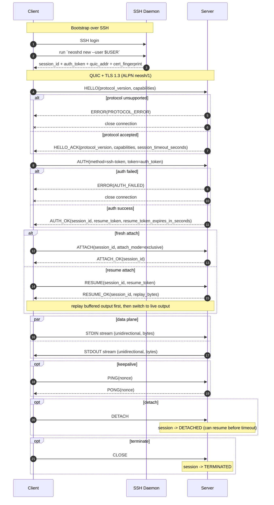

# neosh

neosh is a QUIC-based remote terminal protocol.

- Spec: [`neosh_protocol_v0.1.0.md`](./neosh_protocol_v0.1.0.md)
- ALPN: `neosh/1`

## Server-Client Sequence

## Token Semantics (v0.1.0)

- `auth_token`: opaque, short-lived, single-use, only for `AUTH`.
- `resume_token`: opaque, revocable, used only for `RESUME`.
- If `auth_token` expires before `AUTH`, client must run SSH bootstrap again.

## TLS Trust Bootstrap (v0.1.0)

- `neoshd` auto-generates (or loads) TLS cert/key at bootstrap time.
- SSH bootstrap response MUST include QUIC address and certificate fingerprint.
- Returned `quic_addr` MUST be client-routable for that session.
- `neosh` MUST pin and verify fingerprint on first QUIC handshake in that session.
- `neoshd` default bind policy follows SSH-bootstrap bind policy (`bind-server=ssh`,
  port range `30000-39999`).
