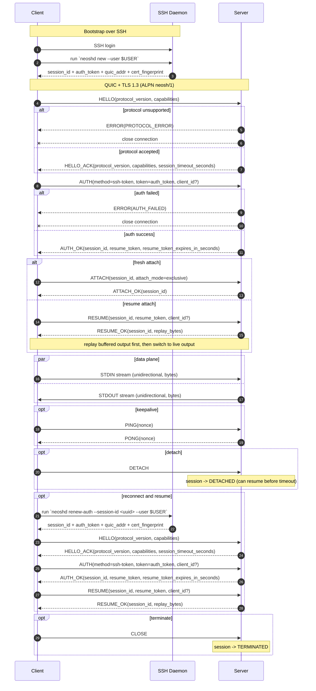

# neosh Protocol Specification

## Version: v0.1.0 (with v0.2.0-draft deltas)

ALPN: `neosh/1`

------------------------------------------------------------------------

# 0. Change Notes (v0.2.0-draft)

The following updates are applied directly in this file and marked inline:

- `[CHANGED v0.2.0-draft]` Optional `client_id` added to `AUTH` and `RESUME`.
- `[ADDED v0.2.0-draft]` Capability `client-id-v1`.
- `[ADDED v0.2.0-draft]` Same-client fast reconnect takeover semantics.
- `[ADDED v0.2.0-draft]` Client identity security notes.

Backwards compatibility policy:

- If `client-id-v1` is not negotiated, implementations MUST use v0.1.0
  behavior.

------------------------------------------------------------------------

# 1. Overview

neosh is a QUIC-based remote terminal protocol.

Design goals:

-   Use SSH for initial authentication (bootstrap)
-   Use QUIC as the data plane
-   Provide session resume capability
-   Provide raw terminal byte stream transport
-   Be extensible for future features

This version (v0.1.0) is a byte-stream model and does NOT include
terminal state synchronization.

## 1.1 Server-Client Sequence



------------------------------------------------------------------------

# 2. Transport Layer

-   QUIC version: IETF QUIC (implementation-defined)
-   TLS: TLS 1.3 (mandatory)
-   ALPN: `neosh/1`
-   Encryption: Required

------------------------------------------------------------------------

# 3. Connection Model

Each QUIC connection represents a client connection.
Each QUIC connection carries exactly one logical session.

Each connection MUST:

1.  Open a bidirectional stream as the control stream
2.  Complete AUTH over the control stream
3.  Send ATTACH or RESUME and receive success
4.  Only after ATTACH_OK or RESUME_OK may data streams be used

------------------------------------------------------------------------

# 4. Stream Layout

## 4.1 Control Stream (bidirectional)

-   Reliable
-   Ordered
-   Required

Used for:

-   HELLO
-   AUTH
-   ATTACH
-   RESUME
-   RESIZE
-   PING/PONG
-   DETACH
-   CLOSE
-   ERROR

------------------------------------------------------------------------

## 4.2 STDIN Stream (client → server, unidirectional)

-   Reliable
-   Ordered
-   Raw byte stream
-   Represents keyboard input

------------------------------------------------------------------------

## 4.3 STDOUT Stream (server → client, unidirectional)

-   Reliable
-   Ordered
-   Raw PTY output (ANSI + UTF-8)

------------------------------------------------------------------------

# 5. Framing

Control messages use length-prefixed JSON:

uint32 length (big-endian)\
bytes payload (UTF-8 JSON)

Unknown fields MUST be ignored.\
Unknown message types MUST produce ERROR.
All failed requests MUST return an ERROR message.

------------------------------------------------------------------------

# 6. Control Messages

## 6.1 HELLO

Client → Server

``` json
{
  "type": "HELLO",
  "protocol_version": "0.1.0",
  "client_version": "neosh/0.1.0",
  "capabilities": ["stdin-bytes", "resume-v1", "client-id-v1"]
}
```

Server → Client

``` json
{
  "type": "HELLO_ACK",
  "protocol_version": "0.1.0",
  "server_version": "neoshd/0.1.0",
  "capabilities": ["stdin-bytes", "resume-v1", "client-id-v1"],
  "session_timeout_seconds": 600
}
```

`[ADDED v0.2.0-draft]` `client-id-v1` indicates support for client identity
semantics in AUTH/RESUME.

If `protocol_version` is unsupported, server MUST return:

``` json
{
  "type": "ERROR",
  "code": "PROTOCOL_ERROR",
  "message": "unsupported protocol_version"
}
```

------------------------------------------------------------------------

## 6.2 AUTH

Client → Server

``` json
{
  "type": "AUTH",
  "method": "ssh-token",
  "token": "opaque-token",
  "client_id": "uuid"
}
```

`[CHANGED v0.2.0-draft]` `client_id` is OPTIONAL for compatibility. When
`client-id-v1` is negotiated, client SHOULD send stable `client_id`.

Server → Client (success)

``` json
{
  "type": "AUTH_OK",
  "session_id": "uuid",
  "resume_token": "opaque-token",
  "resume_token_expires_in_seconds": 86400
}
```

Server → Client (failure)

``` json
{
  "type": "ERROR",
  "code": "AUTH_FAILED",
  "message": "invalid or expired auth token"
}
```

------------------------------------------------------------------------

## 6.3 ATTACH

Client → Server

``` json
{
  "type": "ATTACH",
  "session_id": "uuid",
  "attach_mode": "exclusive"
}
```

Server → Client (success)

``` json
{
  "type": "ATTACH_OK",
  "session_id": "uuid"
}
```

------------------------------------------------------------------------

## 6.4 RESUME

Client → Server

``` json
{
  "type": "RESUME",
  "session_id": "uuid",
  "resume_token": "opaque-token",
  "client_id": "uuid"
}
```

`[CHANGED v0.2.0-draft]` `client_id` is OPTIONAL for compatibility. When
`client-id-v1` is negotiated, server may use it for same-client takeover.

Server → Client (success)

``` json
{
  "type": "RESUME_OK",
  "session_id": "uuid",
  "replay_bytes": 1234
}
```

------------------------------------------------------------------------

## 6.5 RESIZE

``` json
{
  "type": "RESIZE",
  "rows": 40,
  "cols": 120
}
```

------------------------------------------------------------------------

## 6.6 DETACH

``` json
{
  "type": "DETACH"
}
```

------------------------------------------------------------------------

## 6.7 CLOSE

``` json
{
  "type": "CLOSE"
}
```

## 6.8 PING / PONG

Either direction may send:

``` json
{
  "type": "PING",
  "nonce": "opaque-id"
}
```

Peer MUST reply:

``` json
{
  "type": "PONG",
  "nonce": "opaque-id"
}
```

## 6.9 ERROR

Either direction may send:

``` json
{
  "type": "ERROR",
  "code": "PROTOCOL_ERROR",
  "message": "human-readable detail",
  "retryable": false
}
```

------------------------------------------------------------------------

# 7. Session Semantics

Session states:

-   CREATED
-   ATTACHED
-   DETACHED
-   EXPIRED
-   TERMINATED

Rules:

-   After AUTH_OK, session enters CREATED.
-   ATTACH_OK or RESUME_OK moves session to ATTACHED.
-   DETACH moves session to DETACHED.
-   Detached-session inactivity for `session_timeout_seconds` moves to EXPIRED.
-   CLOSE moves session to TERMINATED.

`[ADDED v0.2.0-draft]` Same-client takeover semantics (only when
`client-id-v1` is negotiated):

-   Server tracks `active_client_id` for currently attached connection.
-   If session is ATTACHED and incoming `RESUME.client_id ==
    active_client_id`, server MAY replace owner connection immediately.
-   If incoming `client_id` differs, server MUST reject with
    `ERROR(ATTACH_DENIED)` unless cross-client takeover is explicitly enabled
    by implementation policy.
-   If `client_id` is absent, server SHOULD fall back to v0.1.0 exclusive
    attach behavior.

Timeout definitions:

-   `session_timeout_seconds` controls detached-session inactivity timeout.
-   `resume_token_expires_in_seconds` controls resume token validity.
-   `auth_token` is single-use and only valid for `AUTH`.

------------------------------------------------------------------------

# 8. Output Replay

Server MUST maintain a ring buffer.

On RESUME:

-   If client and server both advertise `resume-v1`, server MUST replay
    available buffered output.
-   Replay MUST complete before live stream resumes.
-   `RESUME_OK.replay_bytes` reports replayed byte count.

------------------------------------------------------------------------

# 9. Error Codes

-   AUTH_FAILED
-   SESSION_NOT_FOUND
-   SESSION_EXPIRED
-   ATTACH_DENIED
-   PROTOCOL_ERROR
-   INTERNAL_ERROR

When a request fails, server MUST reply with ERROR using one of these
codes.

------------------------------------------------------------------------

# 10. Capability Negotiation

v0.1.0 + v0.2.0-draft defines:

-   stdin-bytes
-   resume-v1
-   client-id-v1 (`[ADDED v0.2.0-draft]`)

Future capabilities must be ignored if unsupported.

`[ADDED v0.2.0-draft]` If `client-id-v1` is not negotiated, behavior MUST
remain compatible with v0.1.0.

------------------------------------------------------------------------

# 11. Security Model

-   Initial authentication via SSH-issued token
-   Short-lived auth tokens (≤ 60s recommended)
-   Resume tokens must be revocable
-   TLS encryption mandatory
-   Server certificate must be validated (TOFU or CA)

## 11.1 Token Format

`auth_token` and `resume_token` are opaque tokens. Their internal format is
implementation-defined and not parsed by clients.

## 11.2 auth_token Issuance and Validation

-   `auth_token` is issued during SSH bootstrap together with `session_id`.
-   SSH bootstrap MUST also return `quic_addr` and server certificate
    fingerprint for this session.
-   `quic_addr` MUST be client-routable for the current session. It MUST be an
    address/port that the client can dial directly on its intended QUIC path
    (without relying on implementation-specific local assumptions).
-   Server MUST bind token record to `session_id`, `user_id`, `expires_at`,
    and unique `jti`.
-   Server MUST reject expired token and return `ERROR(AUTH_FAILED)`.
-   Server MUST mark `auth_token` as consumed after successful `AUTH`.
-   Reuse of consumed `auth_token` MUST return `ERROR(AUTH_FAILED)`.
-   For reconnect/resume on a new QUIC connection, server MUST support
    SSH-side re-issuance of `auth_token` for an existing `session_id`
    (e.g. `renew-auth` command), with the same single-use semantics.

## 11.3 TLS Certificate Bootstrap

-   `neoshd` MUST auto-generate a TLS certificate/key if not already present.
-   Generated certs MAY be ephemeral per process or persisted locally by
    implementation policy.
-   During SSH bootstrap, server MUST return certificate fingerprint
    (SHA-256 over DER cert).
-   Client MUST verify QUIC peer cert fingerprint matches bootstrap value
    before sending `AUTH`.
-   For a given `session_id`, certificate fingerprint MUST remain stable for
    the session lifetime (until `TERMINATED` or `EXPIRED`).

## 11.4 resume_token Issuance and Validation

-   On `AUTH_OK`, server MUST issue a revocable opaque `resume_token`.
-   Server MUST store token record with `session_id`, `user_id`,
    `expires_at`, `jti`, and `revoked` flag.
-   On `RESUME`, server MUST verify token exists, is not revoked, is not
    expired, and matches `session_id`.
-   Invalid or expired `resume_token` MUST return `ERROR(SESSION_EXPIRED)` or
    `ERROR(AUTH_FAILED)` by implementation policy.
-   Server MAY rotate `resume_token` on successful resume.

## 11.5 Client Identity (`client_id`) `[ADDED v0.2.0-draft]`

-   `client_id` is an ownership hint for reconnect behavior, not an auth
    credential.
-   Server MUST NOT treat `client_id` alone as proof of user identity.
-   Authentication remains token-based (`auth_token` and `resume_token`).
-   Client SHOULD persist stable `client_id` per local runtime instance.

------------------------------------------------------------------------

# End of Specification
